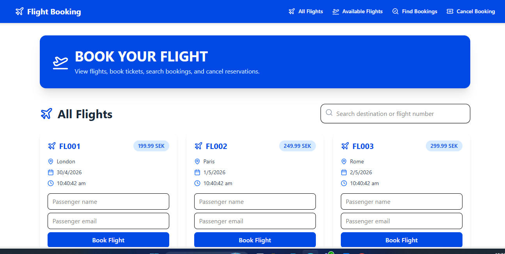
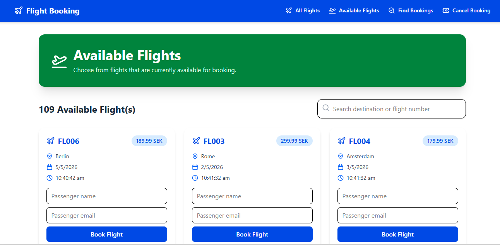
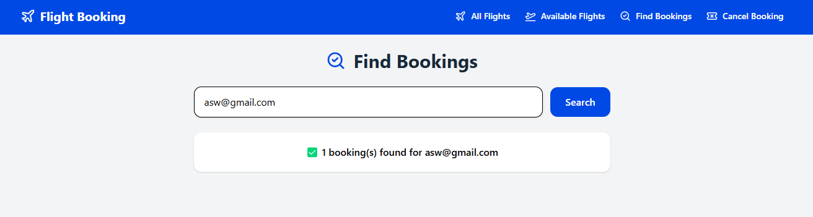
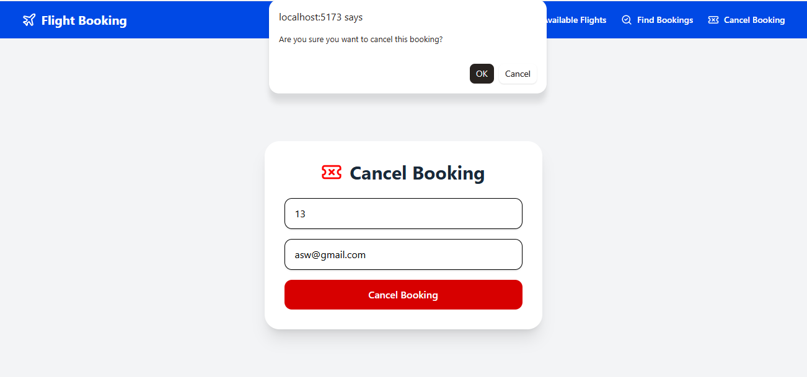

# ✈️ Flight Reservation – Project Test

A modern and responsive Flight Reservation frontend application built using React and TypeScript.
This project connects to a Spring Boot REST API and allows users to view flights, book tickets, search bookings, and cancel reservations.

## Features

### View All Flights

Displays all flights fetched from the backend API.

### Available Flights

Shows only flights currently available for booking.

### Flight Booking

Users can:

Enter passenger name
Enter passenger email
Book a flight directly from the UI
### Search Bookings

Users can search bookings using email address.

### Cancel Booking

Users can cancel a booking using:

Flight ID
Passenger email
### Dynamic Search

Search flights by:

Destination
Flight number
### Responsive UI

Modern responsive design using Tailwind CSS.

## Technologies
- React
- TypeScript
- React Router
- Tailwind CSS
- Lucide React
- React Hooks (useState, useEffect)

## Backend
Spring Boot REST API

# Concepts Learned

This project helped me practice:

* React component architecture
* REST API integration
* TypeScript typing
* State management using React hooks
* Routing with React Router
* Dynamic UI rendering
* Frontend and backend communication

## 🖼️ UI Output
            
### All Flights Page

### Available Flights Page

### Find Bookings Page

### Cancel Booking Page
