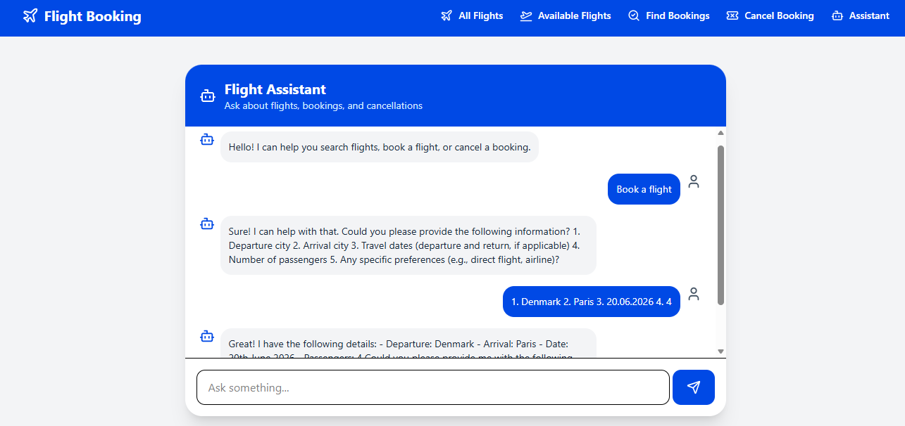

# ✈️ Flight Reservation – Project Test

This project is a Flight Reservation System enhanced with an AI-powered assistant using Spring AI, OpenAI, React, and TypeScript.

The application allows users to:

* View all flights
* View available flights
* Book a flight
* Search bookings by email
* Cancel bookings
* Chat with an AI assistant for flight-related help

## Features

### View All Flights

Displays all flights fetched from the backend API.

### Available Flights

Shows only flights currently available for booking.

### Flight Booking

Users can:

Enter passenger name
Enter passenger email
Book a flight directly from the UI
### Search Bookings

Users can search bookings using email address.

### Cancel Booking

Users can cancel a booking using:

Flight ID
Passenger email
### Dynamic Search

Search flights by:

Destination
Flight number
### Responsive UI

Modern responsive design using Tailwind CSS.

### AI Assistant

The AI assistant can:

* Answer flight-related questions
* Help users search flights
* Guide users through booking
* Help users cancel bookings
* Maintain conversation context using chat memory
### AI Concepts Implemented

* Spring AI ChatClient
* System Message
* In-memory Chat Memory
* OpenAI Integration
* Assistant Chat Endpoint
* Frontend Chatbot UI

## Technologies
- React
- TypeScript
- React Router
- Tailwind CSS
- Lucide React
- React Hooks (useState, useEffect)

## Backend
Spring Boot REST API

# Concepts Learned

This project helped me practice:

* React component architecture
* REST API integration
* TypeScript typing
* State management using React hooks
* Routing with React Router
* Dynamic UI rendering
* Frontend and backend communication

## 🖼️ UI Output
            
### All Flights Page

### Available Flights Page

### Find Bookings Page

### Cancel Booking Page

### AI Assistant Chat Page
